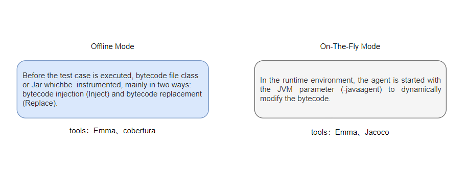
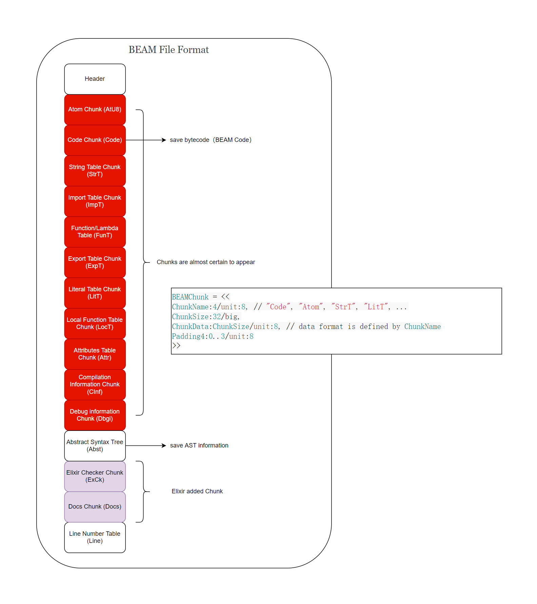
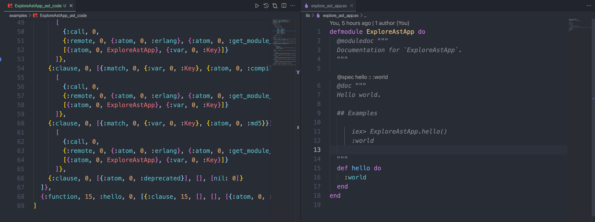
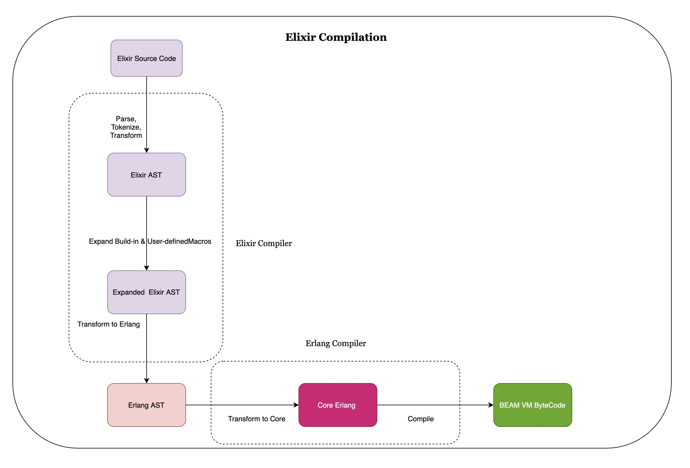
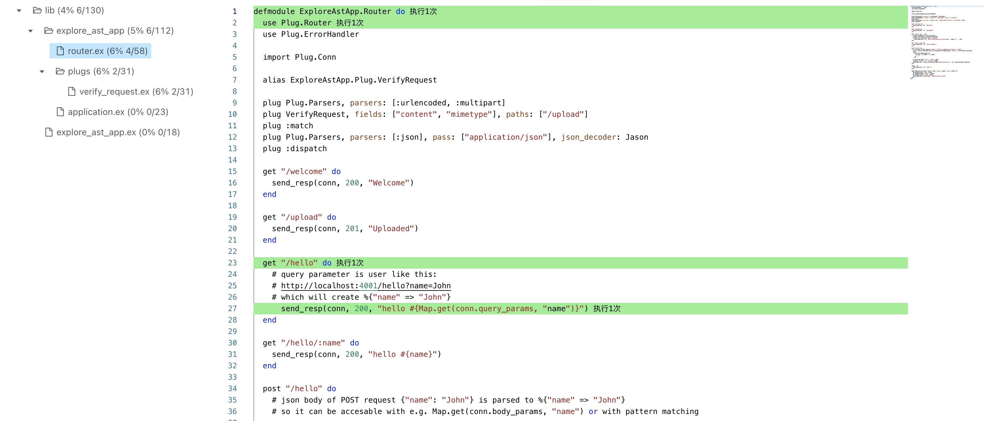

# The solution of Elixir continuous runtime system code coverage collection

> [zh_hans README](./README_cn.md)

Code coverage is an effective means to assist software engineers in verifying code quality. The runtime environment's ability to collect code coverage fully combines black and white box testing capabilities and greatly increases engineers' confidence in software quality. This article introduces a solution for code coverage collection in the Elixir runtime environment, and provides an in-depth insight into its internal principles.

## 1. Brief talk on code coverage

As a [SDET](https://hvitis.dev/google-qa-testing-article-on-manual-and-automation-test-engineers-sdet) or a SWE, we often need to write unit tests or integration test cases to verify the correctness of the system/application, but at the same time we often question whether our tests are adequate. At this time, test coverage is a means of measuring the adequacy of our testing, enhancing the success rate and confidence of the software release, and giving us more reflective perspectives. The note of the value is that high code coverage does not indicate high code quality, but conversely, code coverage is low, and code quality will not be high.

Most programming languages come with the ability to collect unit test coverage, and the same is true for Elixir, the official [mix](https://hexdocs.pm/mix/1.13.4/Mix.Tasks.Test.html#module-coverage) build tool comes with the ability to collect coverage, but it is currently only suitable for offline system, not for runtime system. This article will be based on Erlang's cover module to give a solution for the Elixir runtime system. Since [cover](https://www.erlang.org/doc/man/cover.html) is Erlang's built-in module, but why it works equally well with Elixir, we'll unveil its mystery in a follow-up. Before we get started, let's take a look at the two mainstream ways in which the open source community collects code coverage at runtime (here we look at the bytecode stubbing method of Java, which has a huge ecosystem of the language community):



Next let's focus on the core of elixir runtime coverage collection in this article - the cover module.

## 2. Delve into the Erlang Cover coverage collection implementation mechanism

### 2.1. Introduction Erlang Cover

[cover](https://www.erlang.org/doc/man/cover.html) is part of Erlang's built-in tools set, providing a powerful ability to collect code coverage.

### 2.2. Erlang code coverage collection implementation analysis

As you can see from Erlang's official manual of the cover module, cover counts the number of times every executable line in the Erlang program is executed.

From the introduction of the official documentation, cover can be used for code coverage collection of the runtime system. When the code is instrumented, it does not modify the code source files of any modules or the beam files generated after compilation (that is the industry calls the On-The-Fly mode). Every time the executable row is called, the runtime system updates the number of calls to cover in an in-memory database (erlang ets) for storing data for subsequent coverage analysis.

Next, we'll explore the details of the On-The-Fly mode under cover.

### 2.3. Learn about BEAM File Format

Before we can further understand the details of the cover implementation, it is necessary to understand the format of the BEAM file after the elixir source code is compiled. The compiled product of the Elixir (.ex file), like the Erlang (.erl file), is a binary chunked file, which is divided into several sections to store information used when the program runs (such as virtual machine operation instructions). In Erlang/Elixir, each module will have a corresponding BEAM file. The approximate structure of the BEAM file is as follows:



Let's take a look at the approximate content of the beam file through an Elixir mini [demo](https://github.com/yeshan333/explore_ast_app) project:

- Step 1. Clone the project [yeshan333/explore_ast_app](https://github.com/yeshan333/explore_ast_app) to the local:

```shell
git clone https://github.com/yeshan333/explore_ast_app.git
cd explore_ast_app
```

- Step 2. Build this project in [OTP release format](https://www.erlang.org/doc/design_principles/release_structure.html). (note: Elixir and Erlang need to be installed locally):

```shell
MIX_ENV=prod mix distillery.release
```

It can be noted that each Elixir module is compiled into a BEAM file (can be seen in the directory `_build/prod/rel/explore_ast_app/lib/explore_ast_app-0.1.0/ebin`).

- Step 3. Next, let's view the chunks in the Beam file through Erlang's standard library [beam_lib](https://www.erlang.org/doc/man/beam_lib.html#):

```shell
# open the iex console
iex -S mix
```

View all chunks of the compiled BEAM file (`Elixir.ExploreAstApp.beam`):

```elixir
$ iex -S mix
Erlang/OTP 24 [erts-12.1] [source] [64-bit] [smp:12:12] [ds:12:12:10] [async-threads:1] [jit] [dtrace]

Interactive Elixir (1.12.3) - press Ctrl+C to exit (type h() ENTER for help)
iex(1)> beam_file_path = "_build/prod/rel/explore_ast_app/lib/explore_ast_app-0.1.0/ebin/Elixir.ExploreAstApp.beam"
"_build/prod/rel/explore_ast_app/lib/explore_ast_app-0.1.0/ebin/Elixir.ExploreAstApp.beam"
iex(2)> all_chunks = :beam_lib.all_chunks(String.to_charlist(beam_file_path))
{:ok, ExploreAstApp,
 [
   {'AtU8',
    <<0, 0, 0, 15, 20, 69, 108, 105, 120, 105, 114, 46, 69, 120, 112, 108, 111,
      114, 101, 65, 115, 116, 65, 112, 112, 8, 95, 95, 105, 110, 102, 111, 95,
      95, 10, 97, 116, 116, 114, 105, 98, 117, 116, 101, ...>>},
   {'Code',
    <<0, 0, 0, 16, 0, 0, 0, 0, 0, 0, 0, 169, 0, 0, 0, 14, 0, 0, 0, 4, 1, 16,
      153, 0, 2, 18, 34, 16, 1, 32, 59, 3, 21, 23, 8, 16, 50, 117, 66, 117, 82,
      101, 98, ...>>},
   {'StrT', ""},
   {'ImpT',
    <<0, 0, 0, 2, 0, 0, 0, 11, 0, 0, 0, 12, 0, 0, 0, 2, 0, 0, 0, 11, 0, 0, 0,
      12, 0, 0, 0, 1>>},
   {'ExpT',
    <<0, 0, 0, 4, 0, 0, 0, 15, 0, 0, 0, 1, 0, 0, 0, 13, 0, 0, 0, 15, 0, 0, 0, 0,
      0, 0, 0, 11, 0, 0, 0, 13, 0, 0, 0, 0, 0, 0, 0, 9, ...>>},
   {'LitT',
    <<0, 0, 0, 52, 120, 156, 99, 96, 96, 96, 98, 96, 96, 16, 106, 206, 1, 146,
      140, 25, 76, 229, 172, 25, 169, 57, 57, 249, 137, 12, 89, 64, 190, 88,
      115, 46, 144, 20, 248, ...>>},
   {'LocT', <<0, 0, 0, 0>>},
   {'Attr',
    <<131, 108, 0, 0, 0, 1, 104, 2, 100, 0, 3, 118, 115, 110, 108, 0, 0, 0, 1,
      110, 16, 0, 165, 236, 94, 47, 119, 160, 184, 33, 240, 28, 89, 11, 22, 130,
      207, ...>>},
   {'CInf',
    <<131, 108, 0, 0, 0, 3, 104, 2, 100, 0, 7, 118, 101, 114, 115, 105, 111,
      110, 107, 0, 5, 56, 46, 48, 46, 51, 104, 2, 100, 0, 7, 111, 112, 116, 105,
      111, ...>>},
   {'Dbgi',
    <<131, 80, 0, 0, 1, 143, 120, 156, 117, 80, 203, 78, 3, 49, 12, 76, 233, 67,
      162, 5, 113, 65, 124, 70, 87, 253, 2, 212, 67, 63, 129, 115, 148, 221,
      120, ...>>},
   {'Docs',
    <<131, 80, 0, 0, 0, 241, 120, 156, 93, 142, 205, 10, 194, 48, 16, 132, 215,
      74, 91, 9, 248, 14, 129, 94, 244, 82, 241, 234, 65, 40, 88, 241, 45, 108,
      ...>>},
   {'ExCk',
    <<131, 104, 2, 100, 0, 17, 101, 108, 105, 120, 105, 114, 95, 99, 104, 101,
      99, 107, 101, 114, 95, 118, 49, 116, 0, 0, 0, 1, 100, 0, 7, 101, 120,
      ...>>},
   {'Line',
    <<0, 0, 0, 0, 0, 0, 0, 0, 0, 0, 0, 4, 0, 0, 0, 1, 0, 0, 0, 1, 18, 241, 0,
      22, 108, 105, 98, 47, 101, 120, 112, 108, ...>>}
 ]}
```

As you can see, the obtained chunks correspond to the previous diagram. We can also obtain the Erlang AST (abstract syntax tree) corresponding to the module (`ExploreAstApp`) through the beam_lib standard library:

```elixir
iex(3)> result = :beam_lib.chunks(String.to_charlist(beam_file_path), [:abstract_code])
{:ok,
 {ExploreAstApp,
  [
    abstract_code: {:raw_abstract_v1,
     [
       {:attribute, 1, :file, {'lib/explore_ast_app.ex', 1}},
       {:attribute, 1, :module, ExploreAstApp},
       {:attribute, 1, :compile, [:no_auto_import]},
       {:attribute, 1, :export, [__info__: 1, hello: 0]},
       {:attribute, 1, :spec,
        {{:__info__, 1},
         [
           {:type, 1, :fun,
            [
              {:type, 1, :product,
               [
                 {:type, 1, :union,
                  [
                    {:atom, 1, :attributes},
                    {:atom, 1, :compile},
                    {:atom, 1, :functions},
                    {:atom, 1, :macros},
                    {:atom, 1, :md5},
                    {:atom, 1, :exports_md5},
                    {:atom, 1, :module},
                    {:atom, 1, :deprecated}
                  ]}
               ]},
              {:type, 1, :any, []}
            ]}
         ]}},
       {:function, 0, :__info__, 1,
        [
          {:clause, 0, [{:atom, 0, :module}], [], [{:atom, 0, ExploreAstApp}]},
          {:clause, 0, [{:atom, 0, :functions}], [],
           [
             {:cons, 0, {:tuple, 0, [{:atom, 0, :hello}, {:integer, 0, 0}]},
              {nil, 0}}
           ]},
          {:clause, 0, [{:atom, 0, :macros}], [], [nil: 0]},
          {:clause, 0, [{:atom, 0, :exports_md5}], [],
           [
             {:bin, 0,
              [
                {:bin_element, 0,
                 {:string, 0,
                  [240, 105, 247, 119, 22, 50, 219, 207, 90, 95, 127, 92, ...]},
                 :default, :default}
              ]}
           ]},
          {:clause, 0, [{:match, 0, {:var, 0, :Key}, {:atom, 0, :attributes}}],
           [],
           [
             {:call, 0,
              {:remote, 0, {:atom, 0, :erlang}, {:atom, 0, :get_module_info}},
              [{:atom, 0, ExploreAstApp}, {:var, 0, :Key}]}
           ]},
          {:clause, 0, [{:match, 0, {:var, 0, :Key}, {:atom, 0, :compile}}], [],
           [
             {:call, 0,
              {:remote, 0, {:atom, 0, :erlang}, {:atom, 0, :get_module_info}},
              [{:atom, 0, ExploreAstApp}, {:var, 0, :Key}]}
           ]},
          {:clause, 0, [{:match, 0, {:var, 0, :Key}, {:atom, 0, :md5}}], [],
           [
             {:call, 0,
              {:remote, 0, {:atom, 0, :erlang}, {:atom, 0, :get_module_info}},
              [{:atom, 0, ExploreAstApp}, {:var, 0, :Key}]}
           ]},
          {:clause, 0, [{:atom, 0, :deprecated}], [], [nil: 0]}
        ]},
       {:function, 15, :hello, 0, [{:clause, 15, [], [], [{:atom, 0, :world}]}]}
     ]}
  ]}}
```

It can be seen that AST is expressed in the form of [Erlang Terms](https://www.erlang.org/doc/reference_manual/data_types.html#terms) (called Abstract Code), which is easy to read. The Abstract Code is very useful in the on-the-fly instrumentation process of cover.

The above AST structure is simple and easy to read, and we can easily match it with the source code (`lib/explore_ast_app.ex`) before the module is compiled, although the AST structure is the final Erlang AST, and some extras information are added by the Erlang compiler, but does not affect reading:



The second element in the tuple generally represents the number of source code lines. You can learn more about Erlang's Abstract Format through the official documentation. By observing the Erlang AST structure of several BEAM files, you will be familiar with it. It is worth noting that the Abstract Code was stored in the Abstract Chunk of the BEAM file before OTP 20.

If you want to learn more about BEAM files in detail, you can check out the following two documents:

- [http://beam-wisdoms.clau.se/en/latest/indepth-beam-file.html#beam-term-format](http://beam-wisdoms.clau.se/en/latest/indepth-beam-file.html#beam-term-format)
- [https://blog.stenmans.org/theBeamBook/#BEAM_files](https://blog.stenmans.org/theBeamBook/#BEAM_files)

### 2.4. Elixir source code compilation process

After understanding BEAM File Format, we also need to understand the compilation process of Elixir code, which will help us better understand cover. The process of compiling Elixir source code into BEAM file may not be as you imagined In the same way, instead of directly from Elixir's AST, it becomes executable BEAM Code after being processed by the compiler backend. There is also a process in the middle, as shown in the following figure:



The above process can be described as:

- Step 1、The Elixir source code will be parsed by a custom lexical analyzer ([elixir_tokenizer](https://github.com/elixir-lang/elixir/blob/main/lib/elixir/src/elixir_tokenizer.erl)) and [yacc](https://www.erlang.org/doc/man/yecc.html) to generate the initial version of Elixir AST, which is expressed in the form of Elixir Terms; if you are interested in Elixir's AST, you can follow this Project [arjan/ast_ninja](https://github.com/arjan/ast_ninja);

- Step 2、In the Elixir AST stage, some custom and built-in Macros have not been expanded, and these Macros are expanded into the final Elixir AST in the Expanded Elixir AST stage;

- Step 3、Final Elixir AST will be converted into Erlang standard AST form ([Erlang Abstract Format](https://www.erlang.org/doc/apps/erts/absform.html)) after being processed by Elixir Compiler;

- Step 4、Finally, Elixir will use the Erlang Compiler to process the Erlang AST, converting it into BEAM bytecode executable by the BEAM Virtual Machine (VM). For details on the compiler, see: [elixir_compiler.erl](https://github.com/elixir-lang/elixir/blob/main/lib/elixir/src/elixir_compiler.erl) and [elixir_erl.erl](https://github.com/elixir-lang/elixir/blob/main/lib/elixir/src/elixir_erl.erl) source code For more details on the Erlang Compiler, see [theBeamBook/#CH-Compiler](https://blog.stenmans.org/theBeamBook/#CH-Compiler).

### 2.5. Cover On-The-Fly Instrumentation Implementation

Now it's time for dinner. Let's see how cover performs instrumentation and coverage collection. To use cover to complete code coverage collection, we must know three dragon-slaying swords:


- `cover:start`: Used to create the cover coverage collection process, it will complete the creation of the relevant ets table to store the coverage data, [cover.erl#L159](https://github.com/erlang/otp/blob/2f0a547f78363a2504405e82e3ab3ea35b9e6a88/lib/tools/src/cover.erl#L159) & [cover.erl#L632](https://github.com/erlang/otp/blob/2f0a547f78363a2504405e82e3ab3ea35b9e6a88/lib/tools/src/cover.erl#L632), and we can also start the cover process of the remote Erlang node.

- `cover:compile_beam`: For instrumentation, cover will read the content of the abstract_code of the BEAM file, namely Erlang AST. The key code is in [cover.erl#L1541](https://github.com/erlang/otp/blob/2f0a547f78363a2504405e82e3ab3ea35b9e6a88/lib/tools/src/cover.erl#L1541), and then transform and munge the Erlang AST From, it will call [bump_call](https://github.com/erlang/otp/blob/2f0a547f78363a2504405e82e3ab3ea35b9e6a88/lib/tools/src/cover.erl#L1938), after each executable line will insert the following abstract_code:

```erlang
    {call,A,{remote,A,{atom,A,ets},{atom,A,update_counter}},
     [{atom,A,?COVER_TABLE},
      {tuple,A,[{atom,A,?BUMP_REC_NAME},
                {atom,A,Vars#vars.module},
                {atom,A,Vars#vars.function},
                {integer,A,Vars#vars.arity},
                {integer,A,Vars#vars.clause},
                {integer,A,Line}]},
      {integer,A,1}]}.
```

From the previous understanding of Erlang AST, we know that this is equivalent to inserting the following line of code:

```erlang
ets:update_counter(?COVER_TABLE, #bump{module=Module, function=Function, arity=Arity, clause=Clause, line=Line}, 1).
```

Then for the mungeed Erlang AST Form, cover uses the Erlang Compiler to obtain the Erlang Beam Code (also known as object code. i.e. bytecode, VM execution instructions) from the mungeed AST expression form. [cover.erl#L1580](https://github.com/erlang/otp/blob/2f0a547f78363a2504405e82e3ab3ea35b9e6a88/lib/tools/src/cover.erl#L1580). And then use the Erlang [code server](https://www.erlang.org/doc/man/code.html#load_binary-3) to replace the old object code with the new object code obtained, `load_binary` [cover.erl#L1581](https://github.com/erlang/otp/blob/2f0a547f78363a2504405e82e3ab3ea35b9e6a88/lib/tools/src/cover.erl#L1581) into [ERTS](https://blog.stenmans.org/theBeamBook/#P-ERTS) (Erlang Run Time System). cover completes the Erlang AST instrumentation process, so that whenever the executable line is Executed, the corresponding ets storage table will update the number of times the code line was called.

- `cover:analyze`: Analyze the data stored in the ets table to obtain the number of times the executable line was executed (called), which can be used for statistical coverage data.

> munge: Used to make a series of potentially destructive or irreversible changes to data or files.

## 3. Elixir Application runtime coverage collection example

Through the above, after understanding the implementation details of the Erlang Cover module. Let us take a deployed and running Elixir Application (we will use the previous [yesan333/explore_ast_app](https://github.com/yeshan333/explore_ast_app)) as an example to perform large-scale tests (system & integration tests) of the Elixir application runtime of code line-level coverage collection.

Here we will use a tool library: [ex_integration_coveralls](https://github.com/yeshan333/ex_integration_coveralls) for coverage analysis, which is an Elixir Wrapper for the Erlang module cover to collection Elixir runtime system coverage. Let's start:

- Step 1、Add `ex_integration_coveralls` dependency to `mix.exs` file:

```elixir
  defp deps do
    [
      ...,
      {:ex_integration_coveralls, "~> 0.3.0"}
    ]
  end
```

Pull the dependencies and rebuild the project:

```shell
mix deps.get
MIX_ENV=prod mix distillery.release
```

- Step 2、Start the project:

```shell
_build/prod/rel/explore_ast_app/bin/explore_ast_app foreground
```

- Step 3、Connect to the remote_console of the Elixir runtime application node:

```
_build/prod/rel/explore_ast_app/bin/explore_ast_app remote_console
```

- Step 4、Use `ex_integration_coveralls` (ExIntegrationCoveralls.execute) to start cover and perform code coverage collection:

```elixir
iex(explore_ast_app@127.0.0.1)1> compiled_beam_dir_path = "/Users/yeshan/oss_github/explore_ast_app/_build/prod/rel/explore_ast_app/lib/explore_ast_app-0.1.0/ebin"
"/Users/yeshan/oss_github/explore_ast_app/_build/prod/rel/explore_ast_app/lib/explore_ast_app-0.1.0/ebin"
iex(explore_ast_app@127.0.0.1)2> ExIntegrationCoveralls.execute(compiled_beam_dir_path)
[
  ok: ExploreAstApp.Router,
  ok: ExploreAstApp.Plug.VerifyRequest.IncompleteRequestError,
  ok: ExploreAstApp.Plug.VerifyRequest,
  ok: ExploreAstApp.Application,
  ok: ExploreAstApp
]
iex(explore_ast_app@127.0.0.1)3> compile_time_source_lib_abs_path = "/Users/yeshan/oss_github/explore_ast_app"
"/Users/yeshan/oss_github/explore_ast_app"
iex(explore_ast_app@127.0.0.1)4> source_code_abs_path = "/Users/yeshan/oss_github/explore_ast_app"
"/Users/yeshan/oss_github/explore_ast_app"
iex(explore_ast_app@127.0.0.1)5> ExIntegrationCoveralls.get_total_coverage(compile_time_source_lib_abs_path, source_code_abs_path)
0
```

As you can see, the initial coverage is 0, because no code has been called yet.

- Step 5、Let's execute the following cURL. Let code be called:

```shell
$ curl --location --request GET 'http://localhost:8080/hello'
hello %
```

Check out the code coverage data again in iex console:

```elixir
iex(explore_ast_app@127.0.0.1)6> ExIntegrationCoveralls.get_total_coverage(compile_time_source_lib_abs_path, source_code_abs_path)
17.1
```

As you can see, the cURL (test case) coverage for this project is 17.1%.

We can also use the following methods to view more detailed code coverage, such as viewing the code coverage of `lib/explore_ast_app/router.ex` (`nil` means the line is not an executable line):

```elixir
iex(explore_ast_app@127.0.0.1)7> result = ExIntegrationCoveralls.get_coverage_report(compile_time_source_lib_abs_path, source_code_abs_path)
.......
iex(explore_ast_app@127.0.0.1)8> Enum.at(Map.get(result, :files), 3)
%ExIntegrationCoveralls.Stats.Source{
  coverage: 18.2,
  filename: "lib/explore_ast_app/router.ex",
  hits: 4,
  misses: 18,
  sloc: 22,
  source: [
    %ExIntegrationCoveralls.Stats.Line{
      coverage: 1,
      source: "defmodule ExploreAstApp.Router do"
    },
    %ExIntegrationCoveralls.Stats.Line{coverage: 1, source: "  use Plug.Router"},
    %ExIntegrationCoveralls.Stats.Line{
      coverage: nil,
      source: "  use Plug.ErrorHandler"
    },
    %ExIntegrationCoveralls.Stats.Line{coverage: nil, source: ""},
    %ExIntegrationCoveralls.Stats.Line{
      coverage: nil,
      source: "  import Plug.Conn"
    },
    %ExIntegrationCoveralls.Stats.Line{coverage: nil, source: ""},
    %ExIntegrationCoveralls.Stats.Line{
      coverage: nil,
      source: "  alias ExploreAstApp.Plug.VerifyRequest"
    },
    %ExIntegrationCoveralls.Stats.Line{coverage: nil, source: ""},
    %ExIntegrationCoveralls.Stats.Line{
      coverage: nil,
      source: "  plug Plug.Parsers, parsers: [:urlencoded, :multipart]"
    },
    %ExIntegrationCoveralls.Stats.Line{
      coverage: nil,
      source: "  plug VerifyRequest, fields: [\"content\", \"mimetype\"], paths: [\"/upload\"]"
    },
    %ExIntegrationCoveralls.Stats.Line{coverage: nil, source: "  plug :match"},
    %ExIntegrationCoveralls.Stats.Line{
      coverage: nil,
      source: "  plug Plug.Parsers, parsers: [:json], pass: [\"application/json\"], json_decoder: Jason"
    },
    %ExIntegrationCoveralls.Stats.Line{
      coverage: nil,
      source: "  plug :dispatch"
    },
    %ExIntegrationCoveralls.Stats.Line{coverage: nil, source: ""},
    %ExIntegrationCoveralls.Stats.Line{
      coverage: 0,
      source: "  get \"/welcome\" do"
    },
    %ExIntegrationCoveralls.Stats.Line{
      coverage: 0,
      source: "    send_resp(conn, 200, \"Welcome\")"
    },
    %ExIntegrationCoveralls.Stats.Line{coverage: nil, source: "  end"},
    %ExIntegrationCoveralls.Stats.Line{coverage: nil, source: ""},
    %ExIntegrationCoveralls.Stats.Line{
      coverage: 0,
      source: "  get \"/upload\" do"
    },
    %ExIntegrationCoveralls.Stats.Line{
      coverage: 0,
      source: "    send_resp(conn, 201, \"Uploaded\")"
    },
    %ExIntegrationCoveralls.Stats.Line{coverage: nil, source: "  end"},
    %ExIntegrationCoveralls.Stats.Line{coverage: nil, source: ""},
    %ExIntegrationCoveralls.Stats.Line{
      coverage: 1,
      source: "  get \"/hello\" do"
    },
    %ExIntegrationCoveralls.Stats.Line{
      coverage: nil,
      source: "    # query parameter is user like this:"
    },
    %ExIntegrationCoveralls.Stats.Line{
      coverage: nil,
      source: "    # http://localhost:4001/hello?name=John"
    },
    %ExIntegrationCoveralls.Stats.Line{
      coverage: nil,
      source: "    # which will create %{\"name\" => \"John\"}"
    },
    %ExIntegrationCoveralls.Stats.Line{
      coverage: 1,
      source: "      send_resp(conn, 200, \"hello \#{Map.get(conn.query_params, \"name\")}\")"
    },
    %ExIntegrationCoveralls.Stats.Line{coverage: nil, source: "  end"},
    %ExIntegrationCoveralls.Stats.Line{coverage: nil, source: ""},
    %ExIntegrationCoveralls.Stats.Line{
      coverage: 0,
      source: "  get \"/hello/:name\" do"
    },
    %ExIntegrationCoveralls.Stats.Line{
      coverage: 0,
      source: "    send_resp(conn, 200, \"hello \#{name}\")"
    },
    %ExIntegrationCoveralls.Stats.Line{coverage: nil, source: "  end"},
    %ExIntegrationCoveralls.Stats.Line{coverage: nil, source: ""},
    %ExIntegrationCoveralls.Stats.Line{
      coverage: 0,
      source: "  post \"/hello\" do"
    },
    %ExIntegrationCoveralls.Stats.Line{
      coverage: nil,
      source: "    # json body of POST request {\"name\": \"John\"} is parsed to %{\"name\" => \"John\"}"
    },
    %ExIntegrationCoveralls.Stats.Line{
      coverage: nil,
      source: "    # so it can be accesable with e.g. Map.get(conn.body_params, \"name\") or with pattern matching"
    },
    %ExIntegrationCoveralls.Stats.Line{coverage: 0, source: "    name ="},
    %ExIntegrationCoveralls.Stats.Line{
      coverage: 0,
      source: "      case conn.body_params do"
    },
    %ExIntegrationCoveralls.Stats.Line{
      coverage: 0,
      source: "        %{\"name\" => a_name } -> a_name"
    },
    %ExIntegrationCoveralls.Stats.Line{
      coverage: nil,
      source: "        _ -> \"\""
    },
    %ExIntegrationCoveralls.Stats.Line{coverage: nil, source: "      end"},
    %ExIntegrationCoveralls.Stats.Line{coverage: nil, source: ""},
    %ExIntegrationCoveralls.Stats.Line{coverage: nil, ...},
    %ExIntegrationCoveralls.Stats.Line{...},
    ...
  ]
}
```

Based on the `post_cov_stats_to_ud_ci` interface, it is possible to further interface with internal or external [Codecov](https://about.codecov.io/)-like coverage systems.



Based on this, we can realize the collection of code coverage with large-scale (integration & system) testing capabilities without stopping the Elixir Application.

## 4. Continuous runtime coverage collection solution for large-scale Elixir/Erlang Microservice clusters

With the continuous expansion of the Elixir/Erlang microservice system, the coverage collection method shown in the previous section needs further evolution. Referring to the design of [Prometheus Pull-Base](https://prometheus.io/docs/introduction/overview/#architecture), the overall design (combination of Pull & Push mode) is as follows:


We expand based on [ex_integration_coveralls](https://github.com/yeshan333/ex_integration_coveralls). After the Elixir Application is started, a http worker is started up to expose the code coverage data in real time, which is convenient for communication with heterogeneous systems. The Coverage Push Gateway is responsible for regularly pulling the coverage data (Gateway can be a OTP Application, which allows `ex_integration_coveralls` to directly start up the custom [GenServer Worker](https://github.com/yeshan333/ex_integration_coveralls/blob/main/lib/ex_integration_coveralls/cov_stats_worker.ex) for interactive integration test system in the distributed OTP system), after the integration/system test system informs the end of the test, the Gateway pushes the coverage data to the `Cover Center` for code coverage rate display.

End (long way to go).

## References

- [Code Coverage at Google](https://storage.googleapis.com/pub-tools-public-publication-data/pdf/36f4140541f8dd555fb8aaee2fd719d59ffab041.pdf)
- [Erlang cover](https://www.erlang.org/doc/man/cover.html#description)
- [A brief introduction to BEAM](https://www.erlang.org/blog/a-brief-beam-primer/)
- [A peak into the Erlang compiler and BEAM bytecode](http://gomoripeti.github.io/beam_by_example/)
- [Getting each stage of Elixir’s compilation all the way to the BEAM bytecode](https://elixirforum.com/t/getting-each-stage-of-elixirs-compilation-all-the-way-to-the-beam-bytecode/1873/5)
- [excoveralls](https://github.com/parroty/excoveralls)
- [BeamFile - A peek into the BEAM file](https://github.com/hrzndhrn/beam_file)
- [https://github.com/KronicDeth/intellij-elixir#beam-files](https://github.com/KronicDeth/intellij-elixir#beam-files)