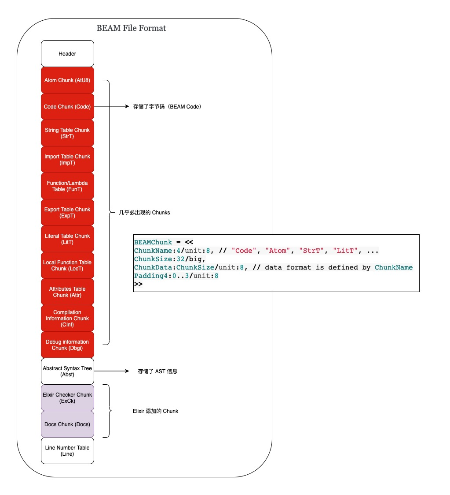

# Elixir 连续运行时代码覆盖率采集方案

## 1. 浅谈代码覆盖率
作为 SET 和 SWE, 我们经常需要编写单元测试或集成测试用例来验证系统/应用的正确性, 但同时我们也常会质疑我们的测试是否充分了. 这时测试覆盖率是可以辅助用来衡量我们测试充分程度的一种手段, 增强发布成功率与信心, 同时给了我们更多可思考的视角. 值的注意的是代码覆盖率高不能说明代码质量高, 但是反过来看, 代码覆盖率低, 代码质量不会高到哪里去.

大部分的编程语言都自带了单元测试覆盖率的收集能力, Elixir 也同样如此, 官方提供的 [mix 构建工具](https://hexdocs.pm/mix/1.13.4/Mix.Tasks.Test.html#module-coverage)自带了覆盖率的收集能力,  但目前只适用于离线（offline）系统, 对于运行时系统, 并不适用. 本文将会基于 Erlang 的 cover 模块, 给出一个 Elixir 运行时系统的解决方案. 既然 cover 是 Erlang 的内置模块, 但为什么它也同样适用于 Elixir, 我们将会在后续的环节中揭开它神秘的面纱. 在开始之前, 让我们先看下开源社区进行运行时系统代码覆盖率采集的两种主流方式（这里我们看下语言社区生态庞大的 Java 的字节码插桩方式）:


接下来让我们关注一下本文的 Elixir 运行时覆盖率收集的核心 - cover 模块.

## 2. 深度解析 Erlang Cover 覆盖率收集实现机制

### 2.1 Erlang Cover 简介

cover 是 Erlang 内置工具集（[tools set](https://www.erlang.org/doc/apps/tools/index.html)）的一部分, 提供了代码覆盖率收集的能力.

### 2.2 Erlang 代码覆盖率收集实现分析

从 Erlang 关于 [cover](https://www.erlang.org/doc/man/cover.html) 模块官方手册可以知道, cover 统计了 Erlang 程序中每一可执行（[executable line](https://www.erlang.org/doc/man/cover.html#description)）被执行的次数.

从官方文档的介绍来看, cover 可以用于运行时系统的代码覆盖率收集, cover 进行代码插桩时, 并不会对任何模块的代码源文件或编译后生成的 beam 文件进行修改（即业界所说的 On-The-Fly 模式）. 运行时系统每次可执行行被调用一次, 都会更新调用次数到 cover 用于存储数据的内存数据库中, 用于后续的覆盖率分析.

接下来, 我们将会去探索下 cover 进行 On-The-Fly 插桩的细节.

### 2.3 了解 BEAM File Format

在进一步了解 cover 实现细节之前, 我们有必要先了解下 Elixir 源码编译后的产物 BEAM 文件的格式. Elixir （.ex 文件）编译后的产物与 Erlang （.erl 文件）一样, 都是一个二进制分块文件（binary chunked file）, 它被划分为了多个 section, 用于存储程序运行时用到的信息（如虚拟机操作指令）. Erlang/Elixir 中, 每一个模块都会有一个对应的 BEAM 文件. BEAM 文件大致的结构如下图:



让我们来通过一个 Elixir mini demo 项目查看下 beam 文件大概内容:

- Step 1、clone 项目 [yeshan333/explore_ast_app](https://github.com/yeshan333/explore_ast_app) 到本地:

```shell
git clone https://github.com/yeshan333/explore_ast_app.git
cd explore_ast_app
```

-  Step 2、构建此项目为 OTP release 格式, 本地需要安装 Elixir 和 Erlang:

```shell
MIX_ENV=prod mix distillery.release
```

可以关注到, 每一个 Elixir 模块, 都被编译成了一个 BEAM 文件（于目录`_build/prod/rel/explore_ast_app/lib/explore_ast_app-0.1.0/ebin` 中可以看到）.

- Step 3、接下来让我们通过 Erlang 的标准库 [beam_lib](https://www.erlang.org/doc/man/beam_lib.html) 文件查看 Beam 文件中的 chunk:

```shell
# 打开 iex console
iex -S mix
```

查看编译后 BEAM 文件 (`Elixir.ExploreAstApp.beam`) 的所有 chunks:

```erlang
$ iex -S mix
Erlang/OTP 24 [erts-12.1] [source] [64-bit] [smp:12:12] [ds:12:12:10] [async-threads:1] [jit] [dtrace]

Interactive Elixir (1.12.3) - press Ctrl+C to exit (type h() ENTER for help)
iex(1)> beam_file_path = "_build/prod/rel/explore_ast_app/lib/explore_ast_app-0.1.0/ebin/Elixir.ExploreAstApp.beam"
"_build/prod/rel/explore_ast_app/lib/explore_ast_app-0.1.0/ebin/Elixir.ExploreAstApp.beam"
iex(2)> all_chunks = :beam_lib.all_chunks(String.to_charlist(beam_file_path))
{:ok, ExploreAstApp,
 [
   {'AtU8',
    <<0, 0, 0, 15, 20, 69, 108, 105, 120, 105, 114, 46, 69, 120, 112, 108, 111,
      114, 101, 65, 115, 116, 65, 112, 112, 8, 95, 95, 105, 110, 102, 111, 95,
      95, 10, 97, 116, 116, 114, 105, 98, 117, 116, 101, ...>>},
   {'Code',
    <<0, 0, 0, 16, 0, 0, 0, 0, 0, 0, 0, 169, 0, 0, 0, 14, 0, 0, 0, 4, 1, 16,
      153, 0, 2, 18, 34, 16, 1, 32, 59, 3, 21, 23, 8, 16, 50, 117, 66, 117, 82,
      101, 98, ...>>},
   {'StrT', ""},
   {'ImpT',
    <<0, 0, 0, 2, 0, 0, 0, 11, 0, 0, 0, 12, 0, 0, 0, 2, 0, 0, 0, 11, 0, 0, 0,
      12, 0, 0, 0, 1>>},
   {'ExpT',
    <<0, 0, 0, 4, 0, 0, 0, 15, 0, 0, 0, 1, 0, 0, 0, 13, 0, 0, 0, 15, 0, 0, 0, 0,
      0, 0, 0, 11, 0, 0, 0, 13, 0, 0, 0, 0, 0, 0, 0, 9, ...>>},
   {'LitT',
    <<0, 0, 0, 52, 120, 156, 99, 96, 96, 96, 98, 96, 96, 16, 106, 206, 1, 146,
      140, 25, 76, 229, 172, 25, 169, 57, 57, 249, 137, 12, 89, 64, 190, 88,
      115, 46, 144, 20, 248, ...>>},
   {'LocT', <<0, 0, 0, 0>>},
   {'Attr',
    <<131, 108, 0, 0, 0, 1, 104, 2, 100, 0, 3, 118, 115, 110, 108, 0, 0, 0, 1,
      110, 16, 0, 165, 236, 94, 47, 119, 160, 184, 33, 240, 28, 89, 11, 22, 130,
      207, ...>>},
   {'CInf',
    <<131, 108, 0, 0, 0, 3, 104, 2, 100, 0, 7, 118, 101, 114, 115, 105, 111,
      110, 107, 0, 5, 56, 46, 48, 46, 51, 104, 2, 100, 0, 7, 111, 112, 116, 105,
      111, ...>>},
   {'Dbgi',
    <<131, 80, 0, 0, 1, 143, 120, 156, 117, 80, 203, 78, 3, 49, 12, 76, 233, 67,
      162, 5, 113, 65, 124, 70, 87, 253, 2, 212, 67, 63, 129, 115, 148, 221,
      120, ...>>},
   {'Docs',
    <<131, 80, 0, 0, 0, 241, 120, 156, 93, 142, 205, 10, 194, 48, 16, 132, 215,
      74, 91, 9, 248, 14, 129, 94, 244, 82, 241, 234, 65, 40, 88, 241, 45, 108,
      ...>>},
   {'ExCk',
    <<131, 104, 2, 100, 0, 17, 101, 108, 105, 120, 105, 114, 95, 99, 104, 101,
      99, 107, 101, 114, 95, 118, 49, 116, 0, 0, 0, 1, 100, 0, 7, 101, 120,
      ...>>},
   {'Line',
    <<0, 0, 0, 0, 0, 0, 0, 0, 0, 0, 0, 4, 0, 0, 0, 1, 0, 0, 0, 1, 18, 241, 0,
      22, 108, 105, 98, 47, 101, 120, 112, 108, ...>>}
 ]}
```

可以看到, 获取到的 chunks 是和之前的图对应的. 我们还可以通过 [beam_lib](https://www.erlang.org/doc/man/beam_lib.html) 标准库获取到模块（ExploreAstApp）对应的 Erlang AST（抽象语法树）:

```erlang
iex(3)> result = :beam_lib.chunks(String.to_charlist(beam_file_path), [:abstract_code])
{:ok,
 {ExploreAstApp,
  [
    abstract_code: {:raw_abstract_v1,
     [
       {:attribute, 1, :file, {'lib/explore_ast_app.ex', 1}},
       {:attribute, 1, :module, ExploreAstApp},
       {:attribute, 1, :compile, [:no_auto_import]},
       {:attribute, 1, :export, [__info__: 1, hello: 0]},
       {:attribute, 1, :spec,
        {{:__info__, 1},
         [
           {:type, 1, :fun,
            [
              {:type, 1, :product,
               [
                 {:type, 1, :union,
                  [
                    {:atom, 1, :attributes},
                    {:atom, 1, :compile},
                    {:atom, 1, :functions},
                    {:atom, 1, :macros},
                    {:atom, 1, :md5},
                    {:atom, 1, :exports_md5},
                    {:atom, 1, :module},
                    {:atom, 1, :deprecated}
                  ]}
               ]},
              {:type, 1, :any, []}
            ]}
         ]}},
       {:function, 0, :__info__, 1,
        [
          {:clause, 0, [{:atom, 0, :module}], [], [{:atom, 0, ExploreAstApp}]},
          {:clause, 0, [{:atom, 0, :functions}], [],
           [
             {:cons, 0, {:tuple, 0, [{:atom, 0, :hello}, {:integer, 0, 0}]},
              {nil, 0}}
           ]},
          {:clause, 0, [{:atom, 0, :macros}], [], [nil: 0]},
          {:clause, 0, [{:atom, 0, :exports_md5}], [],
           [
             {:bin, 0,
              [
                {:bin_element, 0,
                 {:string, 0,
                  [240, 105, 247, 119, 22, 50, 219, 207, 90, 95, 127, 92, ...]},
                 :default, :default}
              ]}
           ]},
          {:clause, 0, [{:match, 0, {:var, 0, :Key}, {:atom, 0, :attributes}}],
           [],
           [
             {:call, 0,
              {:remote, 0, {:atom, 0, :erlang}, {:atom, 0, :get_module_info}},
              [{:atom, 0, ExploreAstApp}, {:var, 0, :Key}]}
           ]},
          {:clause, 0, [{:match, 0, {:var, 0, :Key}, {:atom, 0, :compile}}], [],
           [
             {:call, 0,
              {:remote, 0, {:atom, 0, :erlang}, {:atom, 0, :get_module_info}},
              [{:atom, 0, ExploreAstApp}, {:var, 0, :Key}]}
           ]},
          {:clause, 0, [{:match, 0, {:var, 0, :Key}, {:atom, 0, :md5}}], [],
           [
             {:call, 0,
              {:remote, 0, {:atom, 0, :erlang}, {:atom, 0, :get_module_info}},
              [{:atom, 0, ExploreAstApp}, {:var, 0, :Key}]}
           ]},
          {:clause, 0, [{:atom, 0, :deprecated}], [], [nil: 0]}
        ]},
       {:function, 15, :hello, 0, [{:clause, 15, [], [], [{:atom, 0, :world}]}]}
     ]}
  ]}}
```

可以看到 AST 以 [Erlang Terms](https://www.erlang.org/doc/reference_manual/data_types.html#terms) 的形式表示（称之为 Abstract Code）, 方便阅读. 该 Abstract Code, 在 cover 进行 on-the-fly 插桩过程中大有妙用.

上述 AST 结构简单易读, 我们可以很简单的将其与模块编译前的源代码（`lib/explore_ast_app.ex`）对应起来, 虽然该 AST 结构是最终的 Erlang AST, 被 Erlang 编译器添加了部分额外的信息, 但不影响阅读:


元组（tuple）中的第二个元素一般表示所处的源码行数. 你可以通过官方文档详细了解下 Erlang 的 [Abstract Format](https://www.erlang.org/doc/apps/erts/absform.html), 动手多观察几个 BEAM 文件的 Erlang AST 的结构, 便可了熟于心. 值得注意的是 Abstract Code 在 [OTP 20 之前](https://github.com/erlang/otp/pull/1367)是存放在 BEAM 文件的 Abst Chunk 中的.

如果你想了解更多关于 BEAM 文件的细节, 可以查看以下两篇文档:
- http://beam-wisdoms.clau.se/en/latest/indepth-beam-file.html#beam-term-format
- https://blog.stenmans.org/theBeamBook/#BEAM_files

### 2.4 Elixir 源码编译过程

了解了 BEAM File Format（BEAM 文件格式）之后, 我们还有必要了解下 Elixir 代码的编译过程, 有助于我们更好的理解 cover. Elixir 源码的编译为 BEAM 文件的过程可能和你想象的不太一样, 不直接从 Elixir 的 AST, 经过编译器后端的处理后成为可执行的 BEAM Code, 中间还有一个过程, 如下图所示:


上图的过程可以描述为:
- Step 1、Elixir 源代码会被自定义的词法分析器（[elixir_tokenizer](https://github.com/elixir-lang/elixir/blob/main/lib/elixir/src/elixir_tokenizer.erl)）和 [yacc](https://www.erlang.org/doc/man/yecc.html) 进行语法分析生成初始版的 Elixir AST, AST 以 Elixir Terms 的形式表示；如果你对 Elixir 的 AST 感兴趣, 可以关注下这个项目 [arjan/ast_ninja](https://github.com/arjan/ast_ninja).
- Step 2、在 Elixir AST 阶段, 一些自定义的和内置的宏（Macros）还没有被展开, 这些宏在 Expanded Elixir AST 展开为最终的 Elixir AST（final Elixir AST）；
- Step 3、final Elixir AST 经过 Elixir Compiler 处理会被转换为 Erlang 标准的 AST 形式（[Erlang Abstract Format](https://www.erlang.org/doc/apps/erts/absform.html)）;
- Step 4、最后, Elixir 会使用 Erlang 的 Compiler 处理  Erlang AST, 将其转换为可被 BEAM 虚拟机（VM）执行的 BEAM 字节码. 关于 compiler 的细节, 可以查看: [elixir_compiler.erl](https://github.com/elixir-lang/elixir/blob/main/lib/elixir/src/elixir_compiler.erl) 和 [elixir_erl.erl](https://github.com/elixir-lang/elixir/blob/main/lib/elixir/src/elixir_erl.erl) 源码, 如果你也想了解 Erlang Compiler 的细节, 可以查看 [theBeamBook/#CH-Compiler](https://blog.stenmans.org/theBeamBook/#CH-Compiler).

### 2.5 Cover On-The-Fly 插桩实现

现在该来到正餐环节了, 让我们来看看 cover 是如何进行插桩和覆盖率收集的, 使用 cover 完成代码覆盖率收集, 必须要知道三把屠龙利剑:


- `cover:start`: 用于创建 cover 覆盖率收集进程, 它会完成存储覆盖率数据的相关 ets 表的创建, [cover.erl#L159](https://github.com/erlang/otp/blob/2f0a547f78363a2504405e82e3ab3ea35b9e6a88/lib/tools/src/cover.erl#L159) & [cover.erl#L632](https://github.com/erlang/otp/blob/2f0a547f78363a2504405e82e3ab3ea35b9e6a88/lib/tools/src/cover.erl#L632), 还可以启动远程（remote） Erlang 节点的 cover 进程.
- `cover:compile_beam`: 进行插桩, cover 会读取 BEAM 文件的 abstract_code 的内容, 即 Erlang AST, 关键代码在 [cover.erl#L1541](https://github.com/erlang/otp/blob/2f0a547f78363a2504405e82e3ab3ea35b9e6a88/lib/tools/src/cover.erl#L1541), 然后对 Erlang AST From 进行 transform 和 munge, 它会调用 [bump_call](https://github.com/erlang/otp/blob/2f0a547f78363a2504405e82e3ab3ea35b9e6a88/lib/tools/src/cover.erl#L1938), 在每一个可执行行后插入如下 abstract_code:

```erlang
    {call,A,{remote,A,{atom,A,ets},{atom,A,update_counter}},
     [{atom,A,?COVER_TABLE},
      {tuple,A,[{atom,A,?BUMP_REC_NAME},
                {atom,A,Vars#vars.module},
                {atom,A,Vars#vars.function},
                {integer,A,Vars#vars.arity},
                {integer,A,Vars#vars.clause},
                {integer,A,Line}]},
      {integer,A,1}]}.
```

通过前文对 Erlang AST 的了解, 我们知道这相当于插入了如下一行代码:

```erlang
ets:update_counter(?COVER_TABLE, #bump{module=Module, function=Function, arity=Arity, clause=Clause, line=Line}, 1).
```

然后对于被 munge 后的 Erlang AST Form, cover 使用了 [Erlang Compiler](https://www.erlang.org/doc/man/compile.html#forms-2) 从被 munge 后的 AST 表达形式中获取 Erlang Beam Code（又称 object code, 即字节码, VM 执行指令）[cover.erl#L1580](https://github.com/erlang/otp/blob/2f0a547f78363a2504405e82e3ab3ea35b9e6a88/lib/tools/src/cover.erl#L1580), 然后利用 [Erlang code server](https://www.erlang.org/doc/man/code.html#load_binary-3) 将获取到的新 object code 替换旧的 object code, `load_binary` [cover.erl#L1581](https://github.com/erlang/otp/blob/2f0a547f78363a2504405e82e3ab3ea35b9e6a88/lib/tools/src/cover.erl#L1581) 到了 ERTS（[Erlang Run Time System](https://blog.stenmans.org/theBeamBook/#P-ERTS)）中 . cover 完成了 Erlang AST 插桩流程, 这样, 每当可执行行被执行, 对应的 ets 存储表都会更新该行被 call 的次数.
- `cover:analyze`: 分析 ets 表中存储的数据, 可获取可执行被执行（called）的次数, 可用于统计覆盖率数据.

> munge: 用于对数据或文件进行一系列可能具有破坏性或不可撤销的更改.

## 3. Elixir Application 运行时覆盖率采集示例

通过前文, 在了解了 Erlang Cover 模块的实现细节之后, 让我们以一个部署运行的 Elixir Application（我们会使用之前的 [yeshan333/explore_ast_app](https://github.com/yeshan333/explore_ast_app) ） 为例, 进行Elixir 应用运行时的大型测试（系统 & 集成测试）代码行级覆盖率采集.

这里我们会使用到一个工具库: [ex_integration_coveralls](https://github.com/yeshan333/ex_integration_coveralls) 进行覆盖率的分析, 它是 Erlang 模块 cover 的一个 Elixir Wrapper.  让我们开始:

- Step 1、添加 `ex_integration_coveralls` 依赖到 	`mix.exs` 文件中:

```erlang
  defp deps do
    [
      ...,
      {:ex_integration_coveralls, "~> 0.3.0"}
    ]
  end
```

拉取依赖, 重新构建项目:

```shell
mix deps.get
MIX_ENV=prod mix distillery.release
```

- Step 2、启动项目:

```shell
_build/prod/rel/explore_ast_app/bin/explore_ast_app foreground
```

- Step 3、连接运行时应用节点的 remote_console:

```shell
_build/prod/rel/explore_ast_app/bin/explore_ast_app remote_console
```

- Step 4、利用 ex_integration_coveralls （ExIntegrationCoveralls.execute） 启动 cover, 执行代码覆盖率收集:

```erlang
iex(explore_ast_app@127.0.0.1)1> compiled_beam_dir_path = "/Users/yeshan/oss_github/explore_ast_app/_build/prod/rel/explore_ast_app/lib/explore_ast_app-0.1.0/ebin"
"/Users/yeshan/oss_github/explore_ast_app/_build/prod/rel/explore_ast_app/lib/explore_ast_app-0.1.0/ebin"
iex(explore_ast_app@127.0.0.1)2> ExIntegrationCoveralls.execute(compiled_beam_dir_path)
[
  ok: ExploreAstApp.Router,
  ok: ExploreAstApp.Plug.VerifyRequest.IncompleteRequestError,
  ok: ExploreAstApp.Plug.VerifyRequest,
  ok: ExploreAstApp.Application,
  ok: ExploreAstApp
]
iex(explore_ast_app@127.0.0.1)3> compile_time_source_lib_abs_path = "/Users/yeshan/oss_github/explore_ast_app"
"/Users/yeshan/oss_github/explore_ast_app"
iex(explore_ast_app@127.0.0.1)4> source_code_abs_path = "/Users/yeshan/oss_github/explore_ast_app"
"/Users/yeshan/oss_github/explore_ast_app"
iex(explore_ast_app@127.0.0.1)5> ExIntegrationCoveralls.get_total_coverage(compile_time_source_lib_abs_path, source_code_abs_path)
0
```

可以看到, 初始的覆盖率是 0, 还没有代码被调用.

- Step 5、让我们执行以下 cURL :

 ```shell
 $ curl --location --request GET 'http://localhost:8080/hello'
hello %
 ```

再次查看代码覆盖率数据:

```erlang
iex(explore_ast_app@127.0.0.1)6> ExIntegrationCoveralls.get_total_coverage(compile_time_source_lib_abs_path, source_code_abs_path)
17.1
```

可以看到, cURL（测试）对该项目的覆盖率是 17.1%.

我们还可以使用如下方式查看更为详尽的代码覆盖情况, 比如查看 `lib/explore_ast_app/router.ex` 的代码覆盖情况（nil 表示该行不是 executable line）:

```erlang
iex(explore_ast_app@127.0.0.1)7> result = ExIntegrationCoveralls.get_coverage_report(compile_time_source_lib_abs_path, source_code_abs_path)
.......
iex(explore_ast_app@127.0.0.1)8> Enum.at(Map.get(result, :files), 3)
%ExIntegrationCoveralls.Stats.Source{
  coverage: 18.2,
  filename: "lib/explore_ast_app/router.ex",
  hits: 4,
  misses: 18,
  sloc: 22,
  source: [
    %ExIntegrationCoveralls.Stats.Line{
      coverage: 1,
      source: "defmodule ExploreAstApp.Router do"
    },
    %ExIntegrationCoveralls.Stats.Line{coverage: 1, source: "  use Plug.Router"},
    %ExIntegrationCoveralls.Stats.Line{
      coverage: nil,
      source: "  use Plug.ErrorHandler"
    },
    %ExIntegrationCoveralls.Stats.Line{coverage: nil, source: ""},
    %ExIntegrationCoveralls.Stats.Line{
      coverage: nil,
      source: "  import Plug.Conn"
    },
    %ExIntegrationCoveralls.Stats.Line{coverage: nil, source: ""},
    %ExIntegrationCoveralls.Stats.Line{
      coverage: nil,
      source: "  alias ExploreAstApp.Plug.VerifyRequest"
    },
    %ExIntegrationCoveralls.Stats.Line{coverage: nil, source: ""},
    %ExIntegrationCoveralls.Stats.Line{
      coverage: nil,
      source: "  plug Plug.Parsers, parsers: [:urlencoded, :multipart]"
    },
    %ExIntegrationCoveralls.Stats.Line{
      coverage: nil,
      source: "  plug VerifyRequest, fields: [\"content\", \"mimetype\"], paths: [\"/upload\"]"
    },
    %ExIntegrationCoveralls.Stats.Line{coverage: nil, source: "  plug :match"},
    %ExIntegrationCoveralls.Stats.Line{
      coverage: nil,
      source: "  plug Plug.Parsers, parsers: [:json], pass: [\"application/json\"], json_decoder: Jason"
    },
    %ExIntegrationCoveralls.Stats.Line{
      coverage: nil,
      source: "  plug :dispatch"
    },
    %ExIntegrationCoveralls.Stats.Line{coverage: nil, source: ""},
    %ExIntegrationCoveralls.Stats.Line{
      coverage: 0,
      source: "  get \"/welcome\" do"
    },
    %ExIntegrationCoveralls.Stats.Line{
      coverage: 0,
      source: "    send_resp(conn, 200, \"Welcome\")"
    },
    %ExIntegrationCoveralls.Stats.Line{coverage: nil, source: "  end"},
    %ExIntegrationCoveralls.Stats.Line{coverage: nil, source: ""},
    %ExIntegrationCoveralls.Stats.Line{
      coverage: 0,
      source: "  get \"/upload\" do"
    },
    %ExIntegrationCoveralls.Stats.Line{
      coverage: 0,
      source: "    send_resp(conn, 201, \"Uploaded\")"
    },
    %ExIntegrationCoveralls.Stats.Line{coverage: nil, source: "  end"},
    %ExIntegrationCoveralls.Stats.Line{coverage: nil, source: ""},
    %ExIntegrationCoveralls.Stats.Line{
      coverage: 1,
      source: "  get \"/hello\" do"
    },
    %ExIntegrationCoveralls.Stats.Line{
      coverage: nil,
      source: "    # query parameter is user like this:"
    },
    %ExIntegrationCoveralls.Stats.Line{
      coverage: nil,
      source: "    # http://localhost:4001/hello?name=John"
    },
    %ExIntegrationCoveralls.Stats.Line{
      coverage: nil,
      source: "    # which will create %{\"name\" => \"John\"}"
    },
    %ExIntegrationCoveralls.Stats.Line{
      coverage: 1,
      source: "      send_resp(conn, 200, \"hello \#{Map.get(conn.query_params, \"name\")}\")"
    },
    %ExIntegrationCoveralls.Stats.Line{coverage: nil, source: "  end"},
    %ExIntegrationCoveralls.Stats.Line{coverage: nil, source: ""},
    %ExIntegrationCoveralls.Stats.Line{
      coverage: 0,
      source: "  get \"/hello/:name\" do"
    },
    %ExIntegrationCoveralls.Stats.Line{
      coverage: 0,
      source: "    send_resp(conn, 200, \"hello \#{name}\")"
    },
    %ExIntegrationCoveralls.Stats.Line{coverage: nil, source: "  end"},
    %ExIntegrationCoveralls.Stats.Line{coverage: nil, source: ""},
    %ExIntegrationCoveralls.Stats.Line{
      coverage: 0,
      source: "  post \"/hello\" do"
    },
    %ExIntegrationCoveralls.Stats.Line{
      coverage: nil,
      source: "    # json body of POST request {\"name\": \"John\"} is parsed to %{\"name\" => \"John\"}"
    },
    %ExIntegrationCoveralls.Stats.Line{
      coverage: nil,
      source: "    # so it can be accesable with e.g. Map.get(conn.body_params, \"name\") or with pattern matching"
    },
    %ExIntegrationCoveralls.Stats.Line{coverage: 0, source: "    name ="},
    %ExIntegrationCoveralls.Stats.Line{
      coverage: 0,
      source: "      case conn.body_params do"
    },
    %ExIntegrationCoveralls.Stats.Line{
      coverage: 0,
      source: "        %{\"name\" => a_name } -> a_name"
    },
    %ExIntegrationCoveralls.Stats.Line{
      coverage: nil,
      source: "        _ -> \"\""
    },
    %ExIntegrationCoveralls.Stats.Line{coverage: nil, source: "      end"},
    %ExIntegrationCoveralls.Stats.Line{coverage: nil, source: ""},
    %ExIntegrationCoveralls.Stats.Line{coverage: nil, ...},
    %ExIntegrationCoveralls.Stats.Line{...},
    ...
  ]
}
```

基于 [post_cov_stats_to_ud_ci](https://github.com/yeshan333/ex_integration_coveralls/blob/39e24bc5c9e76a625cddfa4039d386db1429ba41/lib/ex_integration_coveralls.ex#L93) 接口，可以进一步对接内部或外部的类似于 [Codecov](https://about.codecov.io/) 的覆盖率系统.


基于此, 我们可以实现在 Elixir Application 不停止运行的情况下, 配合大型（集成 & 系统）测试能力, 完成代码覆盖率的收集.

## 4. 大规模 Elixir/Erlang 微服务集群连续运行时覆盖率收集方案

随着 Elixir 微服务系统规模的不断扩大, 前一节所展现的覆盖率收集手段需要进一步的演进. 参考 [Prometheus Pull-Base](https://prometheus.io/docs/introduction/overview/#architecture) 的设计, 总体设计（Pull & Push 模式结合）如下:


我们基于 [ex_integration_coveralls](https://github.com/yeshan333/ex_integration_coveralls) 做拓展, 在 Elixir Application 启动后, 拉起一个 http worker 将代码覆盖率数据实时暴露出去, 方便与异构系统的通信. 由 Coverage Push Gateway 负责定时拉取覆盖率数据（Gateway 可以是一个 OTP Application, 这让可以直接让 
`ex_integration_coveralls` 拉起 [GenServer Worker](https://github.com/yeshan333/ex_integration_coveralls/blob/main/lib/ex_integration_coveralls/cov_stats_worker.ex) 在分布式 OTP 系统进行交互集成）, 在集成/系统测试系统告知测试结束后, Gateway 将覆盖率 push 给 Cover Center（覆盖率中心）进行代码覆盖率展示.

End（long way to go）.

## 参考
- [Code Coverage at Google](https://storage.googleapis.com/pub-tools-public-publication-data/pdf/36f4140541f8dd555fb8aaee2fd719d59ffab041.pdf)
- [Erlang cover](https://www.erlang.org/doc/man/cover.html#description)
- [A brief introduction to BEAM](https://www.erlang.org/blog/a-brief-beam-primer/)
- [A peak into the Erlang compiler and BEAM bytecode](http://gomoripeti.github.io/beam_by_example/)
- [Getting each stage of Elixir’s compilation all the way to the BEAM bytecode](https://elixirforum.com/t/getting-each-stage-of-elixirs-compilation-all-the-way-to-the-beam-bytecode/1873/5)
- [excoveralls](https://github.com/parroty/excoveralls)
- [BeamFile - A peek into the BEAM file](https://github.com/hrzndhrn/beam_file)
- [https://github.com/KronicDeth/intellij-elixir#beam-files](https://github.com/KronicDeth/intellij-elixir#beam-files)
